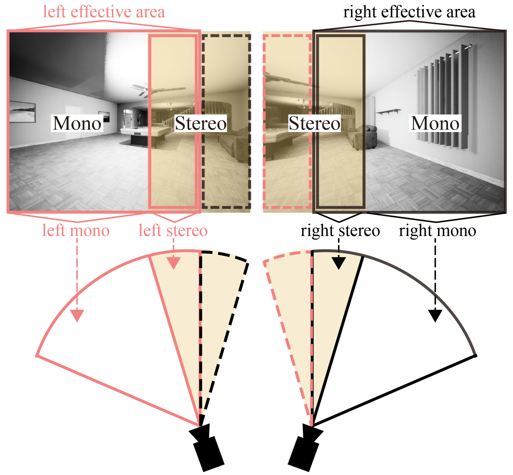
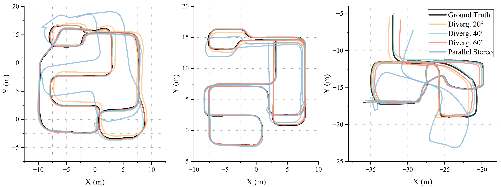
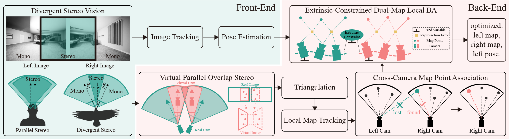

# Bio-Inspired Divergent Stereo vSLAM (DSV-SLAM)

## A Robust vSLAM Framework for Wide FoV and Accurate Localization

This repository contains the reference implementation of the paper:

> **"Bio-Inspired Divergent Stereo SLAM with Enhanced Rotational Robustness"**
>
> Yunlong Jiang, Yicheng Lin, Yuxiu Xu, Xujia Jiao, Bin Han (Huazhong University of Science and Technology)
>
> *IEEE Transactions on Instrumentation and Measurement, 2025*
>
> [[Paper (IEEE)]](https://ieeexplore.ieee.org/document/11510477) | [[Local PDF]](docs/Bio_Inspired_Divergent_Stereo_Vision__A_Robust_vSLAM_Framework_for_Wide_FoV_and_Accurate_Localization_accept.pdf)

---

## Overview

This work proposes a **bio-inspired divergent stereo vSLAM** framework that uses two outward-facing cameras with partial overlap to significantly expand the field of view (FoV), improving tracking robustness during rapid rotations. Unlike conventional parallel stereo setups that suffer from limited FoV, our divergent configuration mimics the eye layout of navigation-oriented species (e.g., flies, bees) to achieve wide-angle perception **without** the distortion issues of fisheye lenses or the complexity of multi-camera rigs.

<p align="center">
  
  <br><em>Divergent stereo vision: two outward-facing cameras with partial overlap expand the overall FoV</em>
</p>

### Key Contributions

1. **Divergent Stereo Modeling with Virtual Cameras** — The FoV is partitioned into a central overlapping stereo region and peripheral monocular regions. Virtual forward-facing cameras restore standard epipolar geometry in the overlap zone.

2. **Cross-Camera Map Point Association** — Left and right cameras maintain independent maps. Map points are dynamically transferred between cameras based on observability, ensuring continuous optimization.

3. **Extrinsics-Constrained Dual-Map Local BA** — Sliding-window bundle adjustment jointly optimizes both maps while only estimating left-camera poses (right-camera poses derived from fixed extrinsics).

### Experimental Results

| Metric | Parallel Stereo | Divergent Stereo (Ours) |
|--------|----------------|------------------------|
| Mean ATE (simulation) | 2.361 m | **0.341 m** (65.8% improvement) |
| Mean ATE (real-world) | 0.681 m | **0.299 m** (56.0% improvement) |
| Avg. tracked features per KF | 156 | **497** (3.2× more) |

<p align="center">
  
  <br><em>Trajectory comparison: parallel stereo (left) vs. divergent stereo (right)</em>
</p>

---

## Architecture

This code is **modified from [OV²SLAM](https://github.com/ov2slam/ov2slam)** (ONERA, GPLv3), with a custom `mono_stereo` mode that implements divergent stereo vision. The main additions include:

- **Virtual camera image generation** (CPU / CUDA-accelerated) via rotational remapping
- **Multi-map management** (left/right camera maps + cross-camera transfer maps)
- **Cross-camera keypoint transfer** between overlapping FoV regions

<p align="center">
  
  <br><em>System architecture of the proposed divergent stereo vSLAM framework</em>
</p>

For the complete system design, please refer to the paper (Section III).

---

## Development Status

**This is a preliminary code release focusing on core module validation.** This version targets UE (Unreal Engine) simulation environments and assumes:
- **Identical left/right camera parameters** (same focal length, image size)
- **Distortion-free pinhole camera model** (no radial/tangential distortion)

### Not yet implemented:
- Global Bundle Adjustment (full BA)
- Loop closure detection and correction (currently disabled)
- Divergent-stereo-specific loop closure strategy
- Full real-time optimization for embedded platforms

These features will be added in future updates. The current code reproduces the core experimental results for UE simulation scenarios.

---

## Build Instructions

### 1. Prerequisites

Ubuntu 20.04 + ROS Noetic required. Install system dependencies:

```bash
sudo apt-get install ros-noetic-cv-bridge ros-noetic-image-transport \
    ros-noetic-tf ros-noetic-pcl-ros libeigen3-dev
```

### 2. Clone and setup workspace

```bash
mkdir -p ~/catkin_ws/src
cd ~/catkin_ws/src
git clone git@github.com:HLkyss/divergent-stereo-vslam.git
cd ~/catkin_ws
```

### 3. Configure CUDA (optional)

If CUDA is not installed, virtual image generation falls back to CPU (slower). If you have a GPU, set the correct compute capability in `CMakeLists.txt` (default: `sm_89` for RTX 40xx).

### 4. Custom OpenCV / cv_bridge paths (if needed)

```bash
export OpenCV_DIR=/path/to/opencv/build
export cv_bridge_DIR=/path/to/cv_bridge/build/devel/share/cv_bridge/cmake
```

### 5. Build

```bash
cd ~/catkin_ws/src/divergent-stereo-vslam
bash build_thirdparty.sh       # Build Ceres, Sophus, iBoW-LCD, obindex2
cd ~/catkin_ws
catkin_make
source devel/setup.bash
```

---

## Usage

### 1. Run SLAM

```bash
cd ~/catkin_ws
source devel/setup.bash
rosrun dsv_slam dsv_slam_node $(pwd)/src/divergent-stereo-vslam/parameters_files/accurate/ue_theta30.yaml
```

### 2. Visualization

```bash
cd ~/catkin_ws
source devel/setup.bash
rviz -d src/divergent-stereo-vslam/dsv_slam_visualization_2map1traj.rviz
```

### 3. Play dataset

The system subscribes to ROS image topics. Publish synchronized stereo image pairs:

```bash
cd /path/to/dataset
python to_rostopic_theta30.py
```

### 4. Save trajectory

Press `Ctrl+C` in the SLAM terminal. Output files are written to the working directory:
- `ov2slam_traj.txt` — TUM format (timestamp tx ty tz qx qy qz qw)
- `ov2slam_traj_kitti.txt` — KITTI format (4×4 pose matrix per line)

---

## Parameter Configurations

The key parameter is `theta`, which controls the **divergent angle of each camera** (in degrees). The two cameras are deflected symmetrically outward, so the **total divergence angle = 2 × theta**.

| File | Per-camera deflection | Total divergence | Description |
|---|---|---|---|
| `accurate/ue_theta0.yaml` | 0° | 0° | Parallel stereo (baseline) |
| `accurate/ue_theta10.yaml` | 10° | 20° | Mild divergence |
| `accurate/ue_theta20.yaml` | 20° | 40° | Moderate divergence |
| `accurate/ue_theta30.yaml` | 30° | 60° | Large divergence |
| `accurate/real_theta15.yaml` | 15° | 30° | Real-world dataset |

All configurations are under `parameters_files/accurate/`, `average/`, or `fast/` (tuning profiles from high-accuracy to low-latency).

---

## Known Limitations

1. **No global BA / loop closure** — Only local BA is implemented. Large-scale drift expected on long trajectories.
2. **UE simulation focus** — Current testing targets Unreal Engine simulation. Real-world deployment needs parameter tuning.
3. **Identical camera assumption** — Left/right cameras assumed identical. Asymmetric setups require code changes.
4. **GPU dependency** — Virtual image generation is significantly slower on CPU.
5. **Code maturity** — Research code; contains commented-out debug code, incomplete features (`// todo`), and mixed Chinese/English comments.

---

## Citation

If you use this work, please cite:

```bibtex
@article{jiang2025bioinspired,
  title   = {Bio-Inspired Divergent Stereo SLAM with Enhanced Rotational Robustness},
  author  = {Jiang, Yunlong and Lin, Yicheng and Xu, Yuxiu and Jiao, Xujia and Han, Bin},
  journal = {IEEE Transactions on Instrumentation and Measurement},
  year    = {2025},
  doi     = {10.1109/TIM.2025.11510477}
}
```

The original OV²SLAM framework should also be cited:

```bibtex
@inproceedings{ferrera2021ov2slam,
  title     = {OV$^2$SLAM: A Fully Online and Versatile Visual SLAM for Real-Time Applications},
  author    = {Ferrera, Maxime and Eudes, Alexandre and Moras, Julien and Sanfourche, Martial and Le Besnerais, Guy},
  booktitle = {IEEE International Conference on Robotics and Automation (ICRA)},
  year      = {2021}
}
```

---

## License & Copyright

This project is a **modified derivative** of [OV²SLAM](https://github.com/ov2slam/ov2slam) (Copyright © 2020 ONERA), released under the **GNU General Public License v3.0** (GPLv3). See [`license.txt`](license.txt) for the full license text.

Divergent stereo modifications copyright © 2024-2025 Huazhong University of Science and Technology (HUST). The ROS package has been renamed from `ov2slam` to `dsv_slam` to distinguish it from the upstream project.

---

## Acknowledgments

This work builds upon the excellent [OV²SLAM](https://github.com/ov2slam/ov2slam) framework developed by ONERA. We thank the original authors — Maxime Ferrera, Alexandre Eudes, Julien Moras, Martial Sanfourche, and Guy Le Besnerais — for open-sourcing their work.
